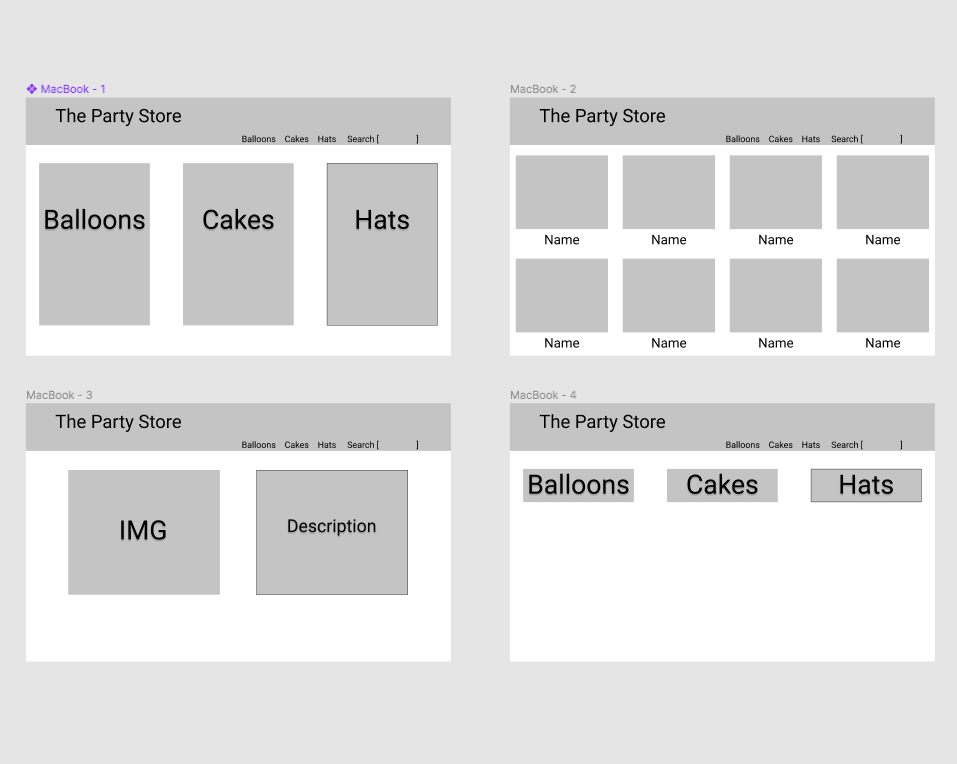

Overview
For this project I created an online store 
My goal for this project was to create a website using Express, MongoDB, Node.js, and Handlebars.

How it works

There is a start and reset button. 
When pressed the start button will create the game board. 
The player then chooses a category and point value. 
Based on the user's selection a question and three multiple choice answers appear. 
If the user guesses the correct answer the point value will be added to their score. 
If the user does not guess the correct answer, then those points will be deducted from their score. 
The game ends when all questions are answered. They will win if their score is over 2000. 

Live site: https://partystore.herokuapp.com/

Technologies Used
Languages - HTML5, CSS3, Javascript.
Frameworks - Node.JS, Express, Mongoose, Handlebars
Design - Google and Adobe Fonts, Bootstrap, Sweet Alerts
Project Planning & Text Editor - Trello, Figma, Visual Studios Code

WireFrame: 

Trello: 

https://trello.com/b/tG8JqcLs/project-2

ERD: 

