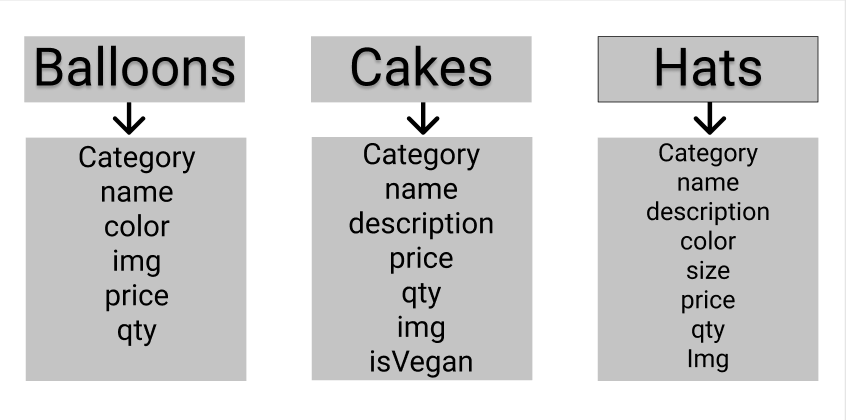

Overview
For this project I created an online store 
My goal for this project was to create a website using Express, MongoDB, Node.js, and Handlebars.

Live site: https://partystore.herokuapp.com/

Technologies Used
HTML5, CSS3, Javascript, Node.JS, Express, Mongoose, Handlebars
Design - Google Fonts, Bootstrap.
Project Planning & Text Editor - Trello, Figma, Visual Studios Code

WireFrame: 

Trello: 

https://trello.com/b/tG8JqcLs/project-2

ERD: 

